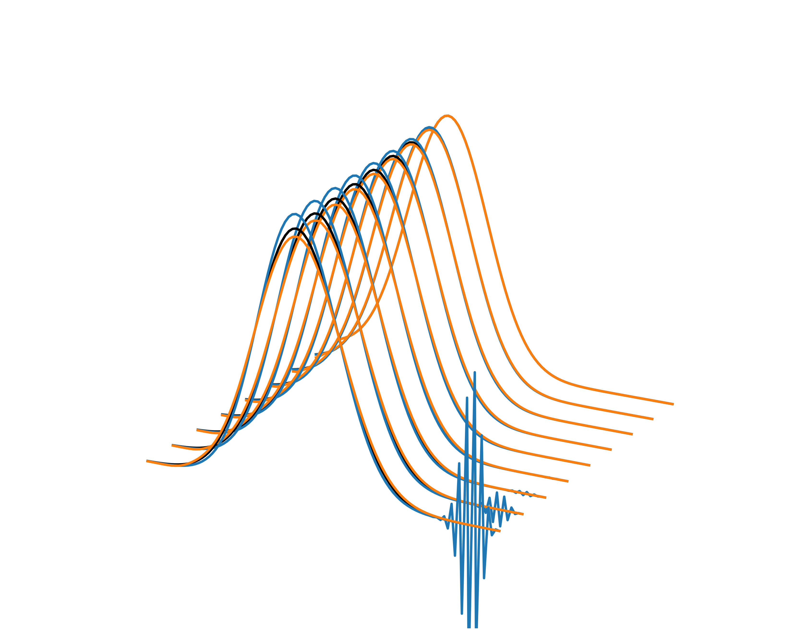

# Paquete de programas de Métodos numéricos



Grupo: 1301.

## Integrantes:

- Contreras Rojas Emanuel Saúl.
- Salazar Hernández Alejandro.
- Rodríguez Medina José Alfredo.

## Método de compilación del programa

En caso de tener la herramienta GNU Make, se puede hacer uso del siguiente comando desde la raíz del repositorio:

```
make
```

De no tenerlo instalado, aún puede hacerse uso del siguiente comando:

```
gcc -Wall -Wextra -Werror -I headers src/main.c src/Funciones_basicas.c src/Opcion_01.c -o Paquete_de_programas-Metodos_numericos.exe -lm
```

## Contenido del paquete

### Primera opción

Se hayan las raíces de las siguietnes funciones con el método de la secante y permite configurar el intervalo inicial de las iteraciones, el número máximo de estas y la tolerancia del error.

1. $f(x) = x^2 cos(x) - 2x$
2. $f(x) = (6 - \frac{2}{x^2}) (\frac{ e^{2 + x} }{4}) + 1$
3. $f(x) = x^3 - 3 sen( x^2 ) + 1$
4. $f(x) = x^3 + 6x^2 + 9.4x +2.5$
